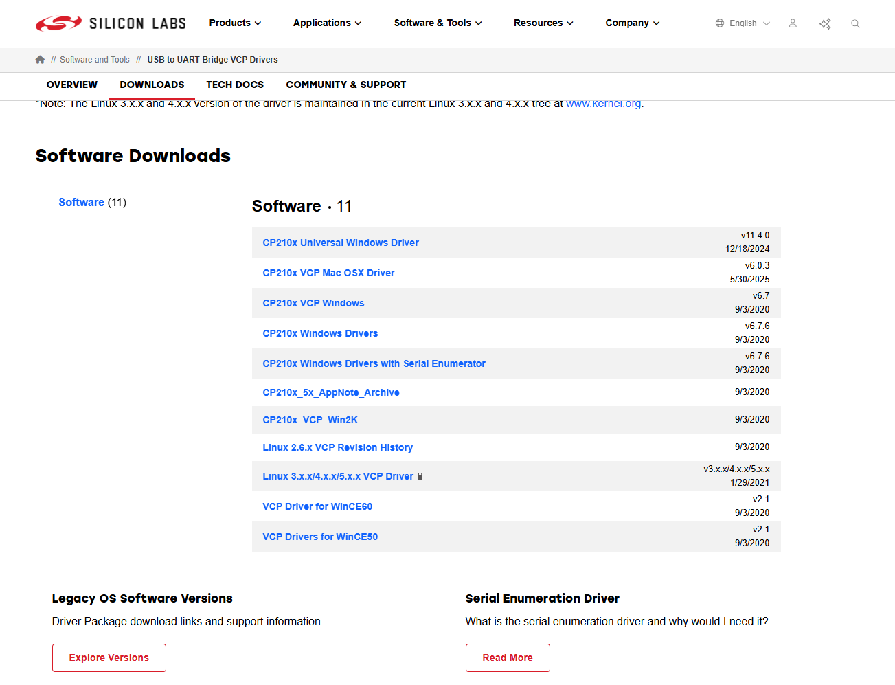
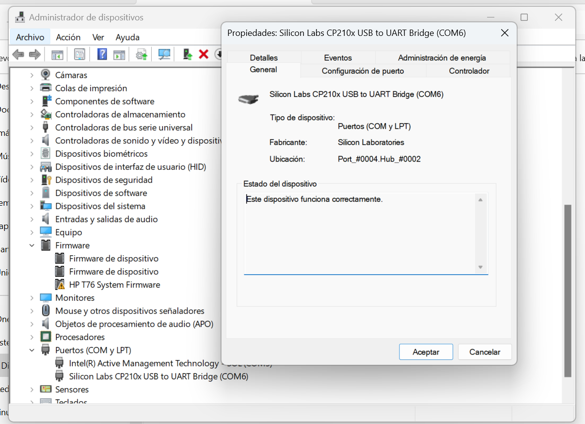
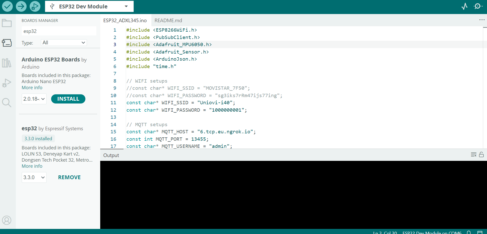
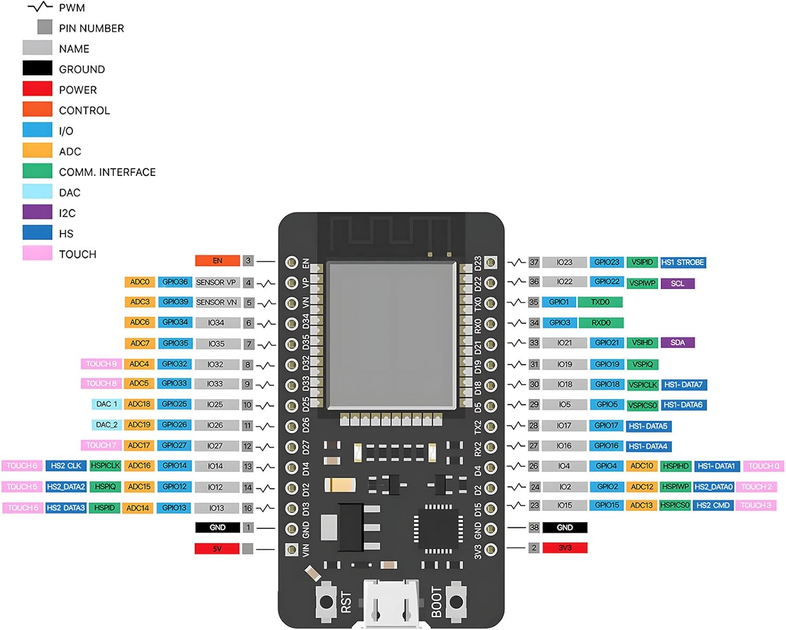

# Description
Arduino sketch to get MPU sensor data and publish to a MQTT topic, using the board ESP32 (ESP32 WROOM-D) and the IMU MPU6050.

## Install Board Drivers

First to develop anything using the Arduino IDE, we must install the correct drivers for our board to be detected by Windows 11 when it was connected:

- You must **install the driver [Windows CP210x Driver v6.7.X](https://www.silabs.com/software-and-tools/usb-to-uart-bridge-vcp-drivers?tab=downloads)** in Windows 11. Select the CP210x Windows Drivers Option. Inside execute the **CP210xVCPInstaller_x64.exe** file.

- Restart your computer after reinstalled the new driver. (Opcional)
- Connect your board to a free computer USB port.
- Click Windows Button + R and execute this command **devmgmt.msc** to open Windows Device Manager.
- Go to **Ports (COM and LPT)** item located your new board device with the COM Port select by windows
- Open the properties of the USB Port used by your board and check version used in **Controllers** tab.

## Install Board SDK

Now we must install the board SDK inside Arduino IDE to develop any skecth in our new board:

- Now we can go to Arduino Board Manage and select the board **esp32 by Espressif Systems version 3.3.0** to be installed

## Install Dependencies:

- Adafruit MPU6050 by Adafruit 2.2.6
- PubSubClient by Nick O'Leray v2.8
- ArduinoJson by Benoit Blanchon v7.4.2

## Pins Board

ESP32 WROOM D32 Pins Board:

