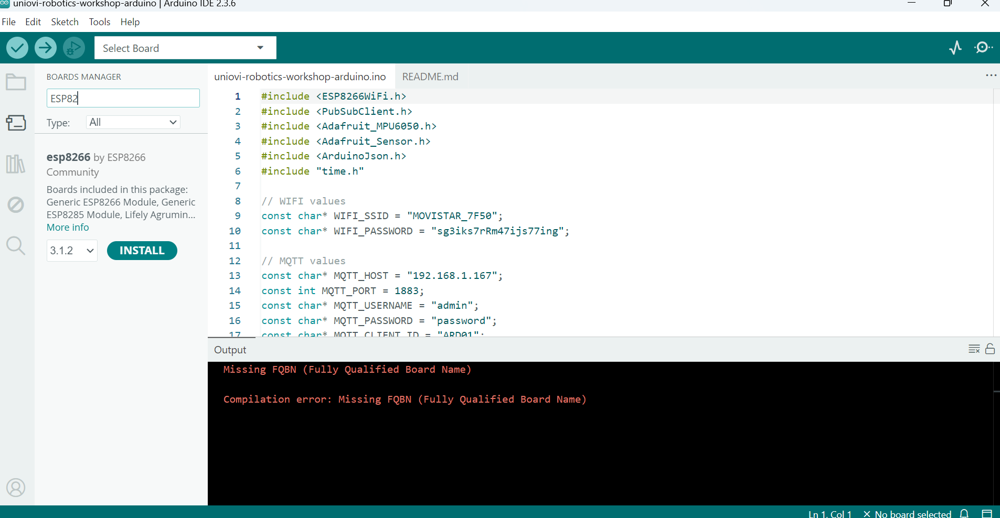

# Description
Microntroller sketch to get MPU sensor data and publish to a MQTT topic using the board ESP8266 and the IMU MPU6050.

## Install Board Drivers

First to develop anything using the Arduino IDE, we must install the correct drivers for our board to be detected by Windows 11 when it was connected:

- You must **uninstall the default Windows CH340 Driver 3.8+**
- **install the driver [Windows CH340 Driver v3.5](https://www.wemos.cc/en/latest/ch340_driver.html "CH340 Driver")** in Windows 11.
- Restart your computer after reinstalled the new driver. (Opcional)
- Connect your board to a free computer USB port.
- Click Windows Button + R and execute this command **devmgmt.msc** to open Windows Device Manager.
- Go to **Ports (COM and LPT)** item located your new board device with the COM Port select by windows.
- Open the properties of the USB Port used by your board and check version used in **Controllers** tab.

## Install Board SDK

Now we must install the board SDK inside Arduino IDE to develop any skecth in our new board:

- We must install the repository in this new Arduino versions to select our board. Add this json file from the Board Manager from File->Settings:

https://arduino.esp8266.com/stable/package_esp8266com_index.json

- Now we can go to Arduino Board Manager and select the **esp8266 by esp8266 community version 3.1.2** to be installed

## Dependencies:

- Adafruit MPU6050 by Adafruit 2.2.6
- PubSubClient by Nick O'Leray v2.8
- ArduinoJson by Benoit Blanchon v7.4.2

## Pins Board

ESP8266 Wemos D R1 Pins Board:

