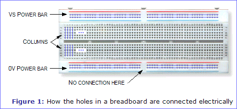

# Description
Microcontroller sketchs to get data from a IMU sensor and publish to a MQTT topic using:

- [ESP8266 microcontroller with MPU6050 IMU sensor](./ESP8266/README_MPU6050.md).

- [ESP32 (ESP32 WROOM-D) microcontroller Blink build in sensor](./ESP32/README_Blink.md).

- [ESP32 (ESP32 WROOM-D) microcontroller with MPU6050 IMU sensor](./ESP32/README_MPU6050.md).

- [ESP32 (ESP32 WROOM-D) microcontroller with ADLX345 IMU sensor](./ESP32/README_ADXL345.md).

## Protobard
To design our controller systems we will use a protoboard where insert the hardware(microcontrollers, sensors and actuators). The internal connections of these protoboards are like this:

