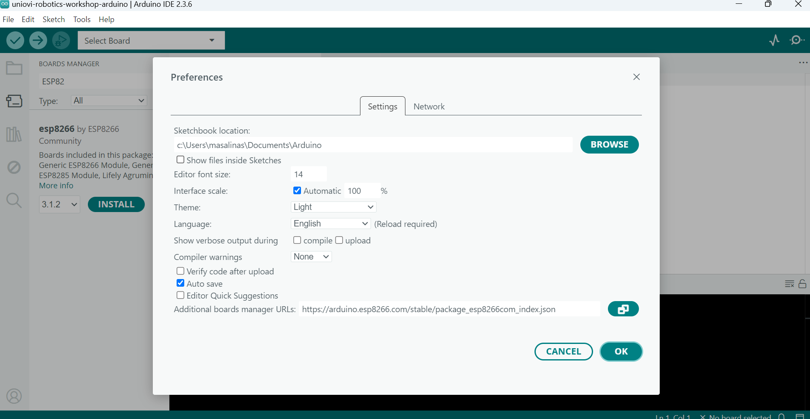
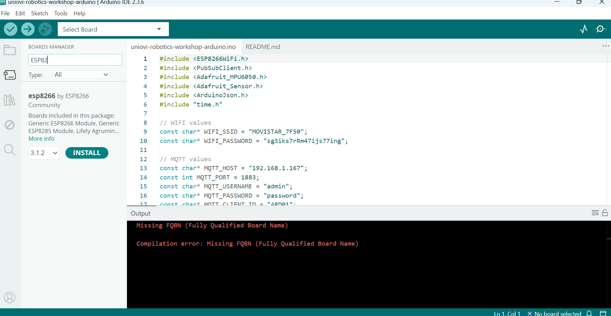
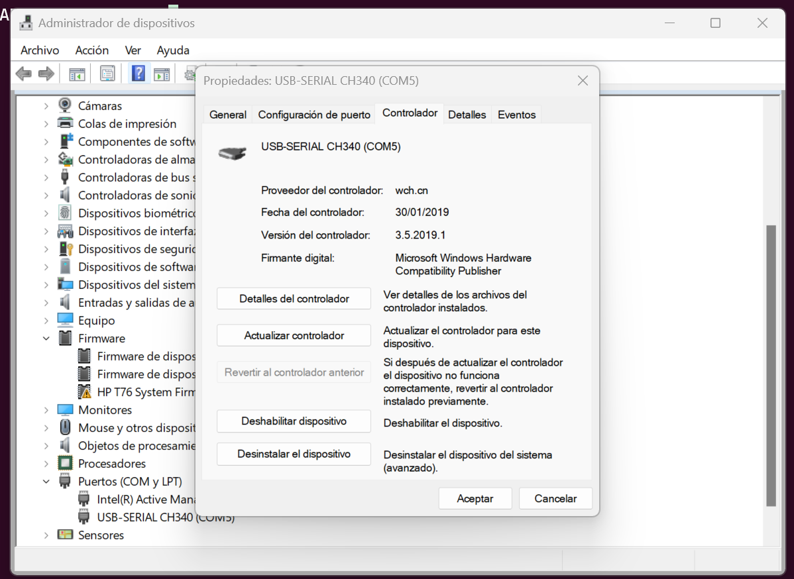

# Description
Arduino sketch to get MPU sensor data and publish to a MQTT topic

## Board 
Install json file to Board Manager from File->Settings. 

https://arduino.esp8266.com/stable/package_esp8266com_index.json

Then install the board ESP8266

- Arduino ESP8266 3.1.2

## Dependencies:

- PubSubClient by Nick O'Leray v2.8
- Adafruit MPU6050 by Adafruit 2.2.6
- ArduinoJson by Benoit Blanchon v7.4.2

## Notes

- If you use the board WeMos D1 you must **uninstall the default Windows CH340 Driver 3.8+** and **install the driver [Windows CH340 Driver v3.5](https://www.wemos.cc/en/latest/ch340_driver.html "CH340 Driver")** in Windows 11.

    To check the driver installed:
    - Restart your computer after reinstalled the new driver.
    - Connect your board to a free computer USB port.
    - Click Windows Button + R and execute this command **devmgmt.msc** to open Windows Device Manager.
    - Go to **Ports (COM and LPT)** item located in the tree devices.
    - Open the properties of the USB Port used by your board and check version used in **Controllers** tab.

